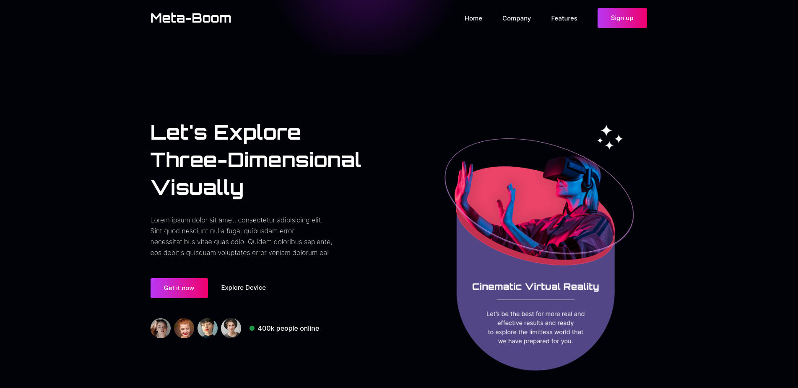

# meta-boom

A virtual reality website

<Br /><Br />

## Getting Started

First, run the development server:

```bash
npm start
```

<Br /><Br />

## Dependencies

```bash
  @testing-library/jest-dom
  @testing-library/react
  @testing-library/user-event
  react
  react-dom
  react-scripts
  web-vitals
  aos
  autoprefixer
  postcss
  react-icons
  react-modal-video
  sass
  swiper
  tailwindcss
```

Open [http://localhost:3000](http://localhost:3000) with your browser to see the result.

<Br /><Br />

Deployed using vercel.
link:- [Meta-Boom](https://meta-boom-destructor007.vercel.app/)

<Br /><Br />

## Preview



<Br /><Br />
